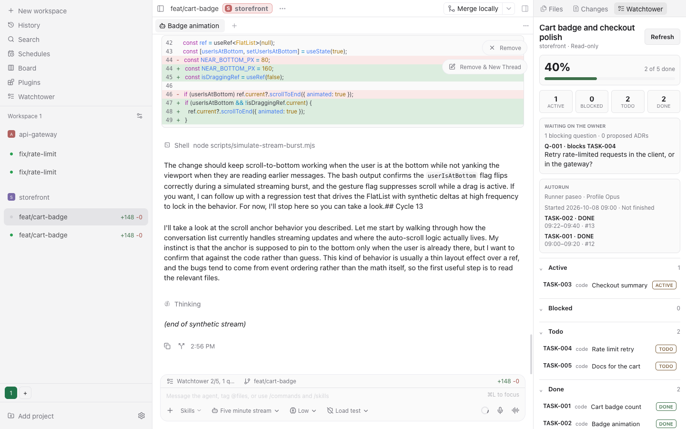
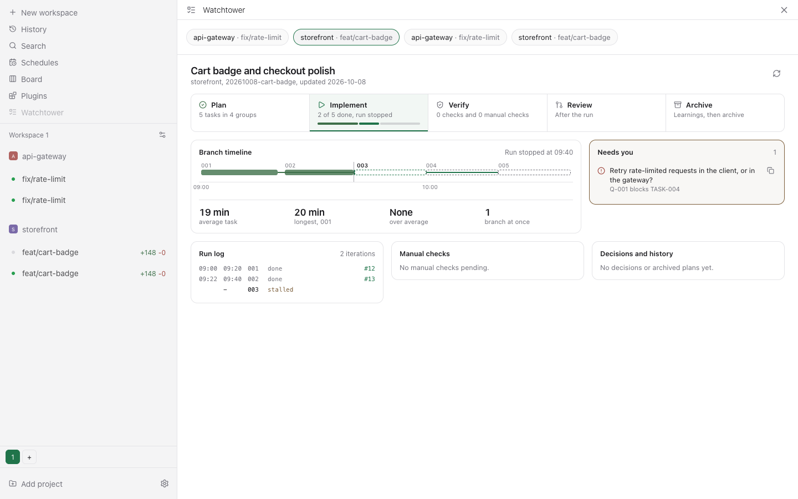
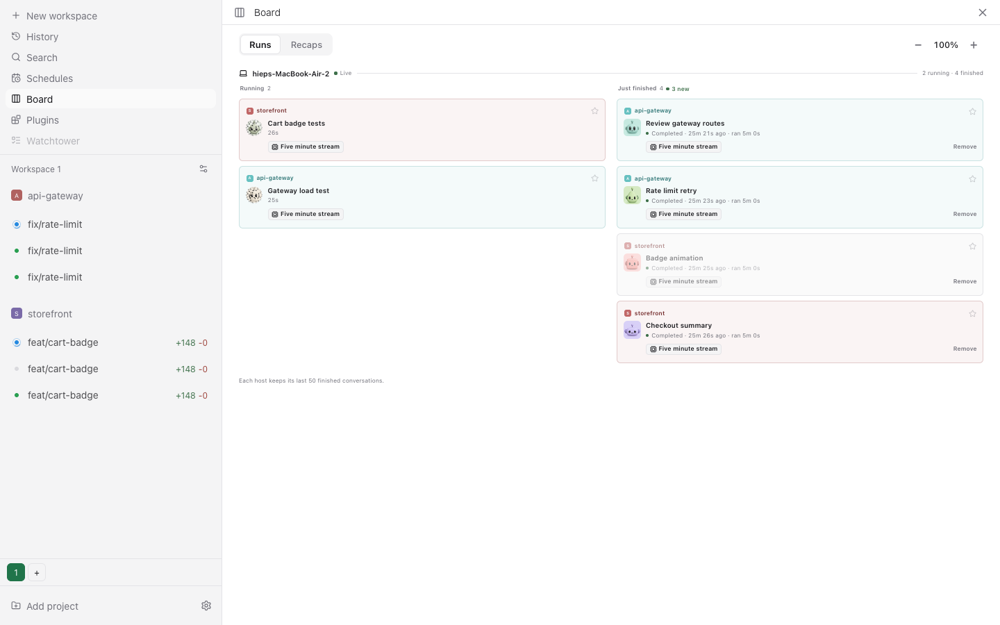

> Bachuc is a personal fork of [Paseo](https://github.com/getpaseo/paseo) by Mohamed Boudra, under the Apache License 2.0. See [NOTICE](NOTICE).

<p align="center">
  
</p>

<h1 align="center">Bachuc</h1>

> **About this repository:** [HiepPP/bachuc](https://github.com/HiepPP/bachuc) is an independently maintained fork of [getpaseo/paseo](https://github.com/getpaseo/paseo).
> Paseo was created by Mohamed Boudra and developed with its contributors.
> This fork is not an official Paseo release and does not imply upstream endorsement.
> The upstream [Apache-2.0 license and copyright notice](LICENSE) are preserved; third-party components retain their respective licenses.
> HiepPP rewrote this README for Bachuc and kept this attribution notice.

Bachuc is Paseo for one user: one interface for Claude Code, Codex, Copilot, OpenCode, and Pi agents, running on your own machine, plus a set of host changes and plugins that only this fork has. The name comes from Ba Chúc, a place in An Giang, Vietnam, and the logo is its 300-year-old tree.

Bachuc ships as a macOS desktop app and the web UI that its daemon serves. Everything Paseo does still works; read the [Paseo docs](https://paseo.sh/docs) for the shared features.

<p align="center">
  
</p>
<p align="center"><sub>A thread with an edit diff (<code>edit-diffs</code>), the Watchtower and branch pills in the composer, and the Watchtower plan panel. Demo data.</sub></p>

## What only Bachuc has

Host changes in `packages/*`:

- **Plugin host APIs.** Hooks before `agent.prompt` and `agent.permission`, daemon-served plugin MCP tools, composer pills, sidebar items and actions, workspace header subtitles, navigation, a composer stop button contribution, and calls to a plugin on another connected host. See [docs/plugins.md](docs/plugins.md).
- **Active machine switch.** The sidebar, aggregated screens, creation defaults, and plugin pages follow one chosen machine.
- **Orchestration from T3 Code.** Stop cascades to subagents, child finish notices are combined, and the daemon owns the message queue. Host APIs for selection actions, quote reveal, and sandboxed HTML frames back the `pr-watch`, `assistant-cite`, and `html-reply` plugins.
- **Runtime close without archive.** Close an agent's runtime and keep the thread, by hand or for idle threads.
- **Composer and app changes.** Composer pills dock in the toolbar, typing anywhere in a thread writes in the composer, and the sidebar footer and badges are quieter.
- **No upstream services.** No default relay, hosted web app, CORS origin, or Hub origin, and no auto-update from upstream releases. See [ADR-0005](watchtower/decisions/ADR-0005-upstream-services-off-over-self-hosting.md).
- **Bachuc brand.** The app name, icons, desktop identity, and release home `~/.bachuc` say Bachuc. Other internal names, such as the `paseo` CLI and `PASEO_*` env vars, stay `paseo`. See [ADR-0009](watchtower/decisions/ADR-0009-bachuc-home-over-paseo-home.md).

## Plugins

The plugins live in [hiep-plugins/plugins](hiep-plugins/plugins). Read [hiep-plugins/README.md](hiep-plugins/README.md) and [hiep-plugins/AGENTS.md](hiep-plugins/AGENTS.md) before you change one.

<p align="center">
  
</p>
<p align="center"><sub><code>watchtower-board</code>: one plan's lifecycle, branch timeline, run log, and the questions that need you. Demo data.</sub></p>

<p align="center">
  
</p>
<p align="center"><sub><code>board</code>: running and just finished conversations across projects. Demo data.</sub></p>

| Plugin                  | What it does                                                                                |
| ----------------------- | ------------------------------------------------------------------------------------------- |
| `board`                 | Shows conversations side by side by project, with subagent clusters, stars, and UI scaling. |
| `workspace-spaces`      | Puts projects in numbered Spaces in the desktop sidebar.                                    |
| `watchtower-board`      | Shows Watchtower plans and tasks, and attaches a task brief to the next message.            |
| `next-prompt-actions`   | Lets you edit or send the suggested next prompts in place.                                  |
| `thread-branch`         | Shows the current Git branch beside the composer, plus a PR pill.                           |
| `thread-context-attach` | Attaches another thread's last reply to your next message.                                  |
| `jev-orchestrator`      | Routes one task to a chosen profile and effort level, with optional scoped delegation.      |
| `jev-evaluator`         | Gives Codex and Claude agents an MCP tool for typed Jev evaluations.                        |
| `jev-permission-gate`   | Answers shell permission requests with rules and Jev, and leaves uncertain ones to you.     |
| `workspace-preflight`   | Checks workspace prerequisites, ports, and health endpoints.                                |
| `pr-watch`              | Wakes an agent when its PR checks finish, someone comments, or a conflict appears.          |
| `assistant-cite`        | Cites selected assistant text as a composer chip and jumps back to the quote.               |
| `html-reply`            | Lets an agent publish a sandboxed HTML page that renders inline in its thread.              |
| `edit-diffs`            | Shows edit tool calls as diffs with line numbers; turn it off per thread.                   |
| `prompt-translate`      | Shows English translations under Vietnamese prompts and rewrites drafts.                    |
| `skill-pins`            | Pins skills in the composer, so each turn tells the agent to load them.                     |
| `thread-janitor`        | Closes the runtimes of threads idle for more than 24 hours and archives empty workspaces.   |
| `idle-runtime-closer`   | Closes the runtimes of threads idle for more than 30 minutes.                               |
| `loop-verify`           | Prototype. Retries a goal in fresh child agents until a verify command passes.              |
| `plugins-nav`           | Adds a sidebar row that opens the Plugins settings page.                                    |
| `stop-orb`              | Replaces the composer stop button with an animated orb on desktop.                          |
| `claude-look`           | Adds a Claude Light theme, a 768 px chat column, and taller reply lines.                    |

## Install

Bachuc has no download. You build it from this checkout on macOS:

1. Install at least one agent CLI with your credentials: [Claude Code](https://docs.anthropic.com/en/docs/claude-code), [Codex](https://github.com/openai/codex), [GitHub Copilot](https://github.com/features/copilot/cli/), [OpenCode](https://github.com/anomalyco/opencode), or [Pi](https://pi.dev).
2. Create the self-signed code-signing identity `Paseo Fork Local` in your login keychain.
3. Open Terminal.app, outside Bachuc, and run `scripts/paseo-release.sh`. It builds the app, installs it as `/Applications/Bachuc.app`, links `~/.local/bin/paseo`, and restarts the daemon on `127.0.0.1:6767`.
4. Keep the checkout in place. The daemon loads the plugins from `hiep-plugins/plugins`.

The script stops the daemon that runs every agent, so it refuses to run inside Bachuc. `--dry-run` shows the steps first. See [Installing a release](docs/development.md#installing-a-release).

## CLI

The CLI keeps the name `paseo`:

```bash
paseo run --provider codex/gpt-5.5 "implement user authentication"
paseo ls                           # list running agents
paseo send abc123 "also add tests" # follow-up task
```

See the [Paseo CLI reference](https://paseo.sh/docs/cli).

## Development

Two instances run side by side: **release** (the installed app, port 6767) and **live** (this checkout from source, port 6768). Test changes on live:

```bash
npm run dev          # live daemon
npm run dev:desktop  # live desktop app
npm run typecheck
npm run lint
```

Start with [CLAUDE.md](CLAUDE.md) and [docs/development.md](docs/development.md). Durable decisions live in [watchtower/DECISIONS.md](watchtower/DECISIONS.md).

## License

Apache-2.0. See [LICENSE](LICENSE) and [NOTICE](NOTICE).
