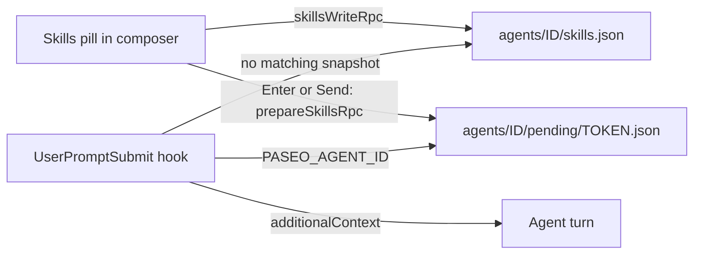

# Skill pins

Pin skills to a Paseo conversation from the composer. Each turn, the agent is told to load the
pinned skills before it answers. The prompt text and the user bubble stay unchanged.

## Goals

- Pick zero or more skills from a fixed catalog in the desktop composer.
- Apply the selection to every turn of that agent until the user changes it.
- Tell the agent to invoke each skill (invoke mode). Never paste skill bodies into the prompt.
- Keep state isolated per Paseo agent. Do not affect Claude or Codex sessions outside Paseo.

Non-goals for v1: user-editable catalog, inline skill bodies, browser/mobile clients, and
providers other than Claude and Codex.

## Why a native hook

The Paseo plugin SDK has no per-turn "before prompt" hook. `server.before` accepts only
`agent.create` and `agent.session_open`. `agent.session_open` runs once per session, so a
selection change in the middle of a conversation would not apply. Rewriting the draft text
would pollute the bubble and history.

Like `prompt-translate`, this plugin registers a native `UserPromptSubmit` hook for Claude and
Codex. The hook adds hidden `additionalContext` for the turn.



## Catalog

The catalog is fixed in `shared/catalog.ts`. The order below is the menu order.

| ID                    | Label               | Claude invocation                 | Codex invocation                |
| --------------------- | ------------------- | --------------------------------- | ------------------------------- |
| `watchtower`          | Watchtower          | Skill tool: `watchtower`          | Read the pinned `SKILL.md` path |
| `chase-goal-claude`   | Chase goal          | Skill tool: `chase-goal-claude`   | Read the pinned `SKILL.md` path |
| `sequential-thinking` | Sequential thinking | Skill tool: `sequential-thinking` | Read the pinned `SKILL.md` path |

All three are user skills in `~/.claude/skills/<id>/SKILL.md`. Codex on this host has only
`chase-goal-claude` installed, so the Codex instruction points to the absolute `SKILL.md` path.
The installer resolves each path and stores it in `hook-runtime.json` (see "Install"). A missing
path is an install error, not a silent skip.

Saved selections may still hold IDs from an older catalog. Reads drop unknown IDs instead of
failing, so changing the catalog does not break existing agents.

## Composer control

- One pill just before the Caveman menu (or before the model selector without it), label
  `Skills` or `Skills · N` when N skills are pinned.
- The menu lists catalog entries with checkboxes. A click toggles one entry and keeps the menu
  open. Esc or an outside click closes it.
- Each toggle saves the full set through `skillsWriteRpc` immediately.
- A new-thread composer has no agent ID yet. Its pill edits one host-level draft instead (see
  "New-thread pins").
- With multiple hosts connected, only the composer's own host handles the pill and snapshots.

`client/dom.ts` copies the React fiber and host helpers from `prompt-translate`; plugins do not
share packages. The pill never moves the Caveman pill, so the two scanners cannot reorder each
other in a loop.

## Default pins

Settings > Plugins > skill-pins > Skill pins holds one switch per catalog skill. New Claude and
Codex agents created through Paseo start with the switched-on skills pinned. Existing agents keep
their own selection.

1. `before("agent.create")` adds `SKILL_PINS_INITIAL=<ids>` to the agent env.
2. `before("agent.session_open")` with reason `create` writes that set to `skills.json`, only when
   the file does not exist yet. The pill then shows it.
3. The hook uses `SKILL_PINS_INITIAL` only while `skills.json` is missing. Once the file exists, it
   wins, even with an empty list. `last-hook.json` reports `source: "initial"` for this case.

## New-thread pins

A new-thread composer starts from the fresh draft, or from the default pins. Each toggle saves
`draft.json` through `skill-pins.draft-write`. The prompt and its bubble stay unchanged.

The next Claude or Codex agent created through Paseo takes the draft in `before("agent.create")`
and deletes it. The draft then flows through `SKILL_PINS_INITIAL` like the default pins. An empty
draft means no pins, not the defaults. A draft older than 10 minutes is ignored.

Limit: a create request does not say which composer sent it. Any other agent created in the draft
window, for example by the CLI or MCP, takes the draft instead. Internal agents never take it.

## State

All state lives under `$PASEO_HOME/plugin-data/skill-pins/`. Files use mode `0600` and atomic
temp-file renames, as in `prompt-translate/server/modes.ts`.

| Path                                | Content                                        |
| ----------------------------------- | ---------------------------------------------- |
| `hook-runtime.json`                 | Resolved Codex `SKILL.md` paths per catalog ID |
| `draft.json`                        | `{ skills, createdAt }` for new-thread pins    |
| `agents/<id>/skills.json`           | `{ "skills": ["watchtower", ...] }`            |
| `agents/<id>/pending/<token>.json`  | `{ hash, skills, createdAt }`                  |
| `agents/<id>/pending/<token>.queue` | `{ queueId }` for a queued send                |
| `agents/<id>/last-hook.json`        | Diagnostics only, never prompt text            |

Agent IDs must match the UUID pattern. Skill IDs must exist in the catalog. Unknown IDs are
rejected on write and ignored with a diagnostic on read.

## Pending snapshots

A queued prompt keeps the selection that was active when it entered the queue. A direct send
needs no snapshot: the hook reads `skills.json`, and every toggle saves it first.

1. The client watches the DOM for new host queue rows. It does not listen for Enter or clicks
   on the send button.
2. For each new row, it calls `prepareSkillsRpc` with `{ agentId, text: row.text, skills }`. The
   server saves `skills.json`, then writes `pending/<token>.json` with the SHA-256 of the text
   (CRLF normalized to LF).
3. The client then calls `bindQueueSkillsRpc` with the row ID. A row that is already bound keeps
   its first snapshot; the new one is dropped. This covers rows seen again after switching agents.
4. Clicking a row's Edit button calls `cancelQueueSkillsRpc` after the binding settles. The click
   itself is never blocked.
5. The hook hashes `prompt` and consumes the oldest matching snapshot. Without a match, it uses
   `skills.json`. Snapshots expire after 24 hours.

Rows that exist before the plugin loads get no snapshot. If an RPC fails, the hook falls back to
`skills.json`.

## RPC contracts

Shared Zod contracts in `shared/contracts.ts`. Wire names use lowercase dotted and hyphenated
segments, because the daemon rejects camelCase RPC names.

| Export                 | Wire name                 | Input                         | Output         |
| ---------------------- | ------------------------- | ----------------------------- | -------------- |
| `skillsReadRpc`        | `skill-pins.read`         | `{ agentId }`                 | `{ skills }`   |
| `skillsWriteRpc`       | `skill-pins.write`        | `{ agentId, skills }`         | `{ skills }`   |
| `prepareSkillsRpc`     | `skill-pins.prepare`      | `{ agentId, text, skills }`   | `{ token }`    |
| `cancelSkillsRpc`      | `skill-pins.cancel`       | `{ agentId, token }`          | `{}`           |
| `bindQueueSkillsRpc`   | `skill-pins.bind-queue`   | `{ agentId, token, queueId }` | `{}`           |
| `cancelQueueSkillsRpc` | `skill-pins.cancel-queue` | `{ agentId, queueId }`        | `{}`           |
| `hostRpc`              | `skill-pins.host`         | `{}`                          | `{ serverId }` |
| `draftReadRpc`         | `skill-pins.draft-read`   | `{}`                          | `{ skills }`   |
| `draftWriteRpc`        | `skill-pins.draft-write`  | `{ skills }`                  | `{ skills }`   |

## Hook

`server/skill-pins-hook.cjs` reads the hook JSON on stdin and writes hook JSON on stdout.

- No valid `PASEO_AGENT_ID` or no string `prompt`: output `{}`.
- Empty selection: output `{}`.
- A skill already requested in the prompt is dropped for this turn. Matches are `/<id>`,
  a plugin-prefixed `/<plugin>:<id>`, and `$<id>` at a word boundary.
- Provider comes from `--claude` or `--codex` in the registered command.
- Any error writes one line to stderr and exits `1`. The hook never exits `2`, because a
  missing skill must not block the user's prompt.

Output shape (same as the Caveman bridge):

```json
{
  "hookSpecificOutput": {
    "hookEventName": "UserPromptSubmit",
    "additionalContext": "..."
  }
}
```

Pinned skills split into two blocks. A catalog entry with `reinvoke: true` goes in the second
block. Each block is dropped when it holds no skill.

Context text for Claude, one line per pinned skill:

```text
The user pinned these skills for this conversation. Before you respond, invoke every one of them with the Skill tool. Skip a skill only if its full text is still visible in your current context; an earlier load that has since been summarised away does not count:
- watchtower
- sequential-thinking
Invoke these skills with the Skill tool on this turn, even if you already invoked them earlier in this conversation:
- chase-goal-claude
Only the skills listed above are pinned now. Stop following any skill that was pinned earlier in this conversation but is missing from this list.
User instructions in the current prompt take priority over pinned skills.
```

Context text for Codex:

```text
The user pinned these skills for this conversation. Before you respond, read each file and follow it. Skip a file only if its full text is still visible in your current context; an earlier read that has since been summarised away does not count:
- /Users/<you>/.claude/skills/watchtower/SKILL.md
Read and follow these files again on this turn, even if you already read them earlier in this conversation:
- /Users/<you>/.claude/skills/chase-goal-claude/SKILL.md
Only the skills listed above are pinned now. Stop following any skill that was pinned earlier in this conversation but is missing from this list.
User instructions in the current prompt take priority over pinned skills.
```

The "still visible in your current context" escape avoids loading the same skill on every turn. It
gives no other reason to skip a pinned skill: an earlier "still applies" clause let the model skip
`brainstorming` in a live test.

The wording used to say "already loaded in this conversation". That let a skill dropped by
compaction still count as loaded, so nothing reloaded it. The current wording ties the escape to
what the model can actually see. This is option O1 of Q3. The model still judges its own context,
so compliance stays probabilistic.

A `reinvoke` skill does not get that escape. It performs work rather than setting a method, so
loading it once is not the same as running it. `chase-goal-claude` is the only such entry today.
The hook keeps its own `reinvokeIds` list; a test checks it against the catalog.

Live check on 2026-09-29, agent `20f8fe57` (Claude Opus 5.5) pinned to `chase-goal-claude` only.
Two read-only goals were sent in a row. Both turns received the same 356-byte context and both
called `Skill(chase-goal-claude)`. On the second call the harness answered:

```text
Skill /chase-goal-claude is already loaded above; instructions unchanged.
```

So `reinvoke` makes the model enter the skill's workflow again on each turn. It does not reload
the `SKILL.md` text while that text is still in context, because Claude Code deduplicates a skill
it already loaded.

That dedupe is scoped to the current context, not to the whole session. See Q3 for the evidence.

The "only the skills listed above" line handles unpinning. A skill loaded on an earlier turn
stays in the conversation, so dropping it from the pin set would otherwise leave the model
following text it can still read.

`last-hook.json` records `agentId`, `sessionId`, `skills`, `source` (`turn`, `agent`, or `initial`),
`hash`, `contextBytes`, and `at`.

## Coexistence with prompt-translate

- `skill-pins` installs no keydown listener and never changes the draft, so the
  `prompt-translate` Enter and Cmd/Ctrl+Enter handling runs unchanged.
- A queue snapshot hashes the queue row text, which is the final text after enhancement.
- Both hooks add `additionalContext`. Claude and Codex concatenate outputs from multiple hooks.

## Install

With the user's authorization:

```sh
node scripts/install-hooks.mjs "$HOME/.claude/skills"
```

Pass the absolute folder that holds every catalog skill. Re-run after changing the catalog.

The script mirrors `prompt-translate/scripts/install-hooks.mjs`:

- Appends one `UserPromptSubmit` entry to `~/.claude/settings.json` with `--claude`.
- Appends one `UserPromptSubmit` entry to `~/.codex/hooks.json` with `--codex`.
- Preserves other settings and writes a `.skill-pins-backup` beside each file.
- Checks that each catalog `SKILL.md` exists, then writes the paths to `hook-runtime.json`.
- `--remove` deletes only this plugin's entries.

Codex requires trusting the new hook in `/hooks`. Existing agents need `paseo agent reload <id>`
after hook changes. Plugin reload does not reload provider hooks. Disabling the Paseo plugin does
not unregister native hooks.

## Compatibility and limits

- Paseo `^0.8.0 || >=0.9.0-beta.2` desktop, through the same private DOM adapter as
  `prompt-translate`. Host DOM changes can break the pill.
- Sends from outside the composer (CLI, MCP `send_agent_prompt`) use `skills.json`.

### A normal skill is invoked once per conversation

The hook injects its context on every turn, but the "already loaded" clause lets the model skip a
skill it invoked earlier. So a normal pinned skill produces one `Skill` call per conversation, not
one per turn.

Measured on 2026-09-29 by reading `~/.claude/projects/*/<session>.jsonl` and counting turns whose
`hook_additional_context` attachment holds the pinned block:

| Session                          | Turns with context | Turns that called the skill |
| -------------------------------- | ------------------ | --------------------------- |
| `695e0c7c`                       | 11                 | 1                           |
| `29dc558c`                       | 5                  | 1                           |
| `41846f9e` (controlled, 2 turns) | 2                  | 1                           |

In the controlled run the agent was pinned to `sequential-thinking`. Turn 1 called the skill. Turn
2 received the same 423-byte context, did not call it, and still answered with the skill's visible
`Thought N/M` markers. The method survives because the skill text stays in the conversation.

This is fine for a skill that sets a method. It is wrong for a skill that performs work, which is
why `reinvoke` exists.

### Subagents never receive the context

The hook runs on `UserPromptSubmit`. A provider-internal subagent receives its task from its parent
agent, not from a user prompt, so that event never fires for it.

Measured on 2026-09-29: a subagent was asked to report whether its own context held the line
`The user pinned these skills for this conversation`. It answered no. A scan of the 40 most recent
transcripts found 0 sidechain records carrying the pinned block, against 41 on main turns.

A subagent still runs its own provider hooks, but never with the parent's selection.

## Open questions

- Q2: Should the Codex path instruction switch to `$<id>` once Codex has these skills installed?

### Q3: what happens to a pinned skill after compaction?

Compaction drops old messages from the model's context. The session transcript keeps everything, so
a boundary is visible as a `type: system`, `subtype: compact_boundary` record whose `compactMetadata`
holds `trigger`, `preTokens`, `postTokens`, and the preserved message UUIDs.

Measured on 2026-09-29 in session `7a192f3a` (auto trigger, 972,699 tokens down to 29,747):

| Line  | Event                                  |
| ----- | -------------------------------------- |
| 11782 | `Skill(taste-skill)` invoked           |
| 11786 | Body injected, 86,881 characters       |
| 11812 | `compact_boundary`                     |
| 13471 | `Skill(taste-skill)` invoked again     |
| 13476 | Body injected again, 86,877 characters |

The second call re-injected the full body. It did not return "already loaded". **Claude Code scopes
its skill dedupe to the current context, not to the session.** A re-invocation after compaction does
reload the text.

So the gap is not in `reinvoke`. It is in the normal block. Its wording says "already loaded in this
conversation", and a compaction summary can still mention the skill, so the model may believe a
dropped skill is loaded and never invoke it again. Nothing reloads it.

Options, none implemented:

| ID  | Option                                                                                                                                    | Token cost                | Trade-off                                                                                                                                                      |
| --- | ----------------------------------------------------------------------------------------------------------------------------------------- | ------------------------- | -------------------------------------------------------------------------------------------------------------------------------------------------------------- |
| O1  | Change the normal block to "already loaded and still visible in your context"                                                             | 0                         | Free, but it only nudges. The model still judges its own context.                                                                                              |
| O2  | A `PostCompact` hook writes a flag. The next `UserPromptSubmit` puts every pinned skill in the reinvoke block once, then clears the flag. | One reload per compaction | Reloads only when needed. Needs a new hook event and a flag file.                                                                                              |
| O3  | Inline the `SKILL.md` body into `additionalContext` every turn                                                                            | Every turn, forever       | `sequential-thinking` is about 950 tokens, `watchtower` about 2,870, `chase-goal-claude` about 4,523. Too expensive, and the text goes stale against the file. |
| O4  | Inline the body only after N turns                                                                                                        | Same as O3 past turn N    | Adds a counter and still pays O3's price later.                                                                                                                |

O1 and O2 combine well and are the suggested pair. O1 costs nothing; O2 handles the case O1 only
nudges. Claude Code 2.1.284 exposes both `PreCompact` and `PostCompact`, so O2 is buildable.
`PostCompact` is the right one: the flag must be set after the drop, not before.

### Q4: should the subagent gap use `SubagentStart`?

Yes, and the path is confirmed by a live probe. Static reading first, from the Claude Code 2.1.284
binary at `/Users/hiep/.local/share/claude/versions/2.1.284` with `rg -a`, then a live run on
2026-09-29.

The event accepts `additionalContext` and delivers it to the subagent:

```text
hookEventName:R("SubagentStart"),additionalContext:o().optional()
...!D?.isolatedContext&&!Xs){let w=on({type:"hook_additional_context",content:wo,hookName:"SubagentStart"
```

That is the same `hook_additional_context` record this plugin already produces on
`UserPromptSubmit`.

Live probe: a temporary `SubagentStart` hook was added to `~/.claude/settings.json`, beside the
existing entry. It logged its stdin and returned `additionalContext: "PIN-TEST"`. A subagent was
then asked whether that string was in its context. It answered yes and quoted:

```text
SubagentStart hook additional context: PIN-TEST
```

The hook was removed afterwards and `settings.json` was restored from a backup; both files hash
to `06cbde99…`.

The logged payload was:

```json
{
  "session_id": "d55beead-…",
  "transcript_path": "…/d55beead-….jsonl",
  "cwd": "…/plugins/skill-pins",
  "prompt_id": "015a16de-…",
  "agent_id": "a2922bd9460d481a6",
  "agent_type": "jev-native-2cbb2f41b6db77d5c09609a0",
  "hook_event_name": "SubagentStart"
}
```

What that settles:

- **Delivery works.** `additionalContext` reaches the subagent verbatim. Delivery is skipped when
  `isolatedContext` is set, or when an internal flag `Xs` is set. What `Xs` means is still
  unverified; it did not block this run.
- **The payload has no parent field**, and no `prompt` field either, so the hook cannot dedupe
  against a task that already names the skill. Note the live payload also lacked `scratchpad_dir`,
  `permission_mode`, and `effort`, which appear in the binary's shared-field builder.
- **The parent is reachable through the environment.** The hook process had
  `PASEO_AGENT_ID=4a9c5411-…`, which is this agent's own Paseo record (`~/.paseo/agents/…json`,
  title `/caveman ultra`, holding this `session_id`). So the same lookup the `UserPromptSubmit`
  hook already does would work here: read `agents/$PASEO_AGENT_ID/skills.json` and emit the pinned
  set. `PASEO_HOME` was present too.
- **The matcher runs on `agent_type`**, and that value is not always the requested type. This run
  asked for `general-purpose` and got `jev-native-2cbb2f41b6db77d5c09609a0`, because the
  `jev-orchestrator` plugin reroutes subagent types. A matcher on a fixed type name would miss.

`SubagentStop` is a separate schema with `stop_hook_active`, `agent_transcript_path`, and
`last_assistant_message`. No `additionalContext` output schema was found for it.

Open design choice, not implemented: a subagent inherits the parent's pins, which may be wrong for
a narrow task. A `reinvoke` skill in particular would make every subagent start goal work.

## Verify (after implementation)

```sh
npm install
npm run format && npm run typecheck && npm run lint && npm test
paseo plugin install "$PWD" --id skill-pins
paseo plugin ls skill-pins --json
paseo plugin logs skill-pins
```

Tests cover: catalog validation, snapshot hash match and expiry, queue bind and cancel, prompt
dedupe of explicit invocations, per-provider context text, and `{}` output outside Paseo.
