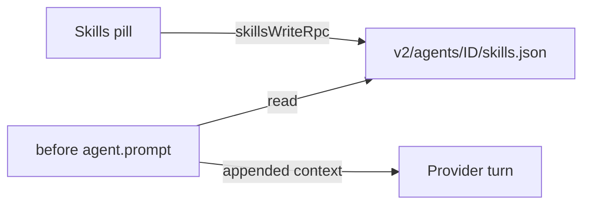

# Skill pins

Pin skills to a Paseo conversation from the composer. Each turn, the agent is told to load the
pinned skills before it answers. The user bubble and the timeline keep the typed text.

Requires the Paseo fork `>=0.10.2-beta.900`. The stable 0.10.1 host refuses the plugin.

## How it works



- A shared composer pill shows on every agent composer: in the toolbar beside the model
  selector on desktop, in the track above the composer on mobile. Its label is `Skills`, or the
  pinned skills' short names (`Watch · Seq`). Its menu toggles each catalog skill for that agent
  and saves at once; **Bỏ chọn tất cả** clears them.
- The daemon `agent.prompt` hook appends the pin context to each turn of Claude and Codex agents.
  Steers get no context. A skill named in the prompt (`/id` or `$id`) is left out for that turn.
- New workspace also shows **Skills**. Draft choices, including an empty selection, transfer
  before the first prompt. Untouched drafts use **Settings → Skill pins** defaults.
- Queued prompts use the selection at send time.
- State lives in `$PASEO_HOME/plugin-data/skill-pins/v2/agents/<id>/skills.json`. Archiving an
  agent deletes its folder.

## Catalog

The catalog is fixed in `shared/catalog.ts`, in menu order.

| ID                    | Claude                            | Codex                                             |
| --------------------- | --------------------------------- | ------------------------------------------------- |
| `watchtower`          | Skill tool: `watchtower`          | Read `<skills root>/watchtower/SKILL.md`          |
| `chase-goal-claude`   | Skill tool: `chase-goal-claude`   | Same, asked again on every turn                   |
| `sequential-thinking` | Skill tool: `sequential-thinking` | Read `<skills root>/sequential-thinking/SKILL.md` |

The skills root is `~/.claude/skills`, or `SKILL_PINS_SKILLS_ROOT` in the daemon environment.
`chase-goal-claude` runs work, so the context asks for it again on every turn.

## Migration from the native hook

Earlier versions used a native `UserPromptSubmit` hook installed into `~/.claude/settings.json`
and `~/.codex/hooks.json`. This version does not need it. The `v2` data folder keeps an old hook
from another checkout silent for agents of this host. Remove old registrations with the old
checkout's `node scripts/install-hooks.mjs --remove` when no host uses them.

## Checks

```sh
npm run typecheck && npm run lint && npm test
```
