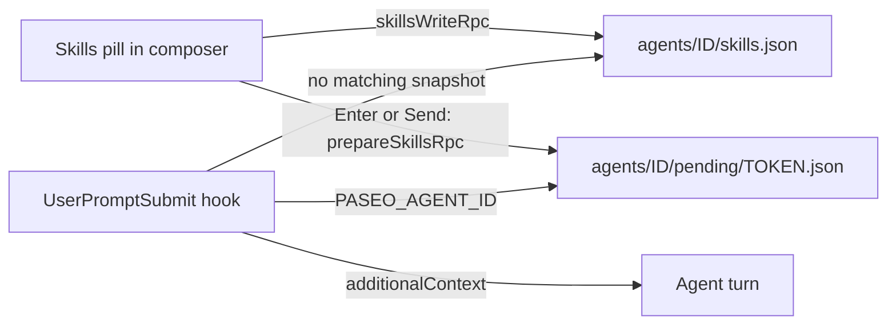

# Skill pins

Pin skills to a Paseo conversation from the composer. Each turn, the agent is told to load the
pinned skills before it answers. The prompt text and the user bubble stay unchanged.

## Goals

- Pick zero or more skills from a fixed catalog in the desktop composer.
- Apply the selection to every turn of that agent until the user changes it.
- Tell the agent to invoke each skill (invoke mode). Never paste skill bodies into the prompt.
- Keep state isolated per Paseo agent. Do not affect Claude or Codex sessions outside Paseo.

Non-goals for v1: user-editable catalog, inline skill bodies, browser/mobile clients, and
providers other than Claude and Codex.

## Why a native hook

The Paseo plugin SDK has no per-turn "before prompt" hook. `server.before` accepts only
`agent.create` and `agent.session_open`. `agent.session_open` runs once per session, so a
selection change in the middle of a conversation would not apply. Rewriting the draft text
would pollute the bubble and history.

Like `prompt-translate`, this plugin registers a native `UserPromptSubmit` hook for Claude and
Codex. The hook adds hidden `additionalContext` for the turn.



## Catalog

The catalog is fixed in `shared/catalog.ts`. The order below is the menu order.

| ID                    | Label               | Claude invocation                 | Codex invocation                |
| --------------------- | ------------------- | --------------------------------- | ------------------------------- |
| `watchtower`          | Watchtower          | Skill tool: `watchtower`          | Read the pinned `SKILL.md` path |
| `chase-goal-claude`   | Chase goal          | Skill tool: `chase-goal-claude`   | Read the pinned `SKILL.md` path |
| `sequential-thinking` | Sequential thinking | Skill tool: `sequential-thinking` | Read the pinned `SKILL.md` path |

All three are user skills in `~/.claude/skills/<id>/SKILL.md`. Codex on this host has only
`chase-goal-claude` installed, so the Codex instruction points to the absolute `SKILL.md` path.
The installer resolves each path and stores it in `hook-runtime.json` (see "Install"). A missing
path is an install error, not a silent skip.

Saved selections may still hold IDs from an older catalog. Reads drop unknown IDs instead of
failing, so changing the catalog does not break existing agents.

## Composer control

- One pill just before the Caveman menu (or before the model selector without it), label
  `Skills` or `Skills · N` when N skills are pinned.
- The menu lists catalog entries with checkboxes. A click toggles one entry and keeps the menu
  open. Esc or an outside click closes it.
- Each toggle saves the full set through `skillsWriteRpc` immediately.
- A new-thread composer has no agent ID yet. Its pill edits one host-level draft instead (see
  "New-thread pins").
- With multiple hosts connected, only the composer's own host handles the pill and snapshots.

`client/dom.ts` copies the React fiber and host helpers from `prompt-translate`; plugins do not
share packages. The pill never moves the Caveman pill, so the two scanners cannot reorder each
other in a loop.

## Default pins

Settings > Plugins > skill-pins > Skill pins holds one switch per catalog skill. New Claude and
Codex agents created through Paseo start with the switched-on skills pinned. Existing agents keep
their own selection.

1. `before("agent.create")` adds `SKILL_PINS_INITIAL=<ids>` to the agent env.
2. `before("agent.session_open")` with reason `create` writes that set to `skills.json`, only when
   the file does not exist yet. The pill then shows it.
3. The hook uses `SKILL_PINS_INITIAL` only while `skills.json` is missing. Once the file exists, it
   wins, even with an empty list. `last-hook.json` reports `source: "initial"` for this case.

## New-thread pins

A new-thread composer starts from the fresh draft, or from the default pins. Each toggle saves
`draft.json` through `skill-pins.draft-write`. The prompt and its bubble stay unchanged.

The next Claude or Codex agent created through Paseo takes the draft in `before("agent.create")`
and deletes it. The draft then flows through `SKILL_PINS_INITIAL` like the default pins. An empty
draft means no pins, not the defaults. A draft older than 10 minutes is ignored.

Limit: a create request does not say which composer sent it. Any other agent created in the draft
window, for example by the CLI or MCP, takes the draft instead. Internal agents never take it.

## State

All state lives under `$PASEO_HOME/plugin-data/skill-pins/`. Files use mode `0600` and atomic
temp-file renames, as in `prompt-translate/server/modes.ts`.

| Path                                | Content                                        |
| ----------------------------------- | ---------------------------------------------- |
| `hook-runtime.json`                 | Resolved Codex `SKILL.md` paths per catalog ID |
| `draft.json`                        | `{ skills, createdAt }` for new-thread pins    |
| `agents/<id>/skills.json`           | `{ "skills": ["watchtower", ...] }`            |
| `agents/<id>/pending/<token>.json`  | `{ hash, skills, createdAt }`                  |
| `agents/<id>/pending/<token>.queue` | `{ queueId }` for a queued send                |
| `agents/<id>/last-hook.json`        | Diagnostics only, never prompt text            |

Agent IDs must match the UUID pattern. Skill IDs must exist in the catalog. Unknown IDs are
rejected on write and ignored with a diagnostic on read.

## Pending snapshots

A queued prompt keeps the selection that was active when it entered the queue. A direct send
needs no snapshot: the hook reads `skills.json`, and every toggle saves it first.

1. The client watches the DOM for new host queue rows. It does not listen for Enter or clicks
   on the send button.
2. For each new row, it calls `prepareSkillsRpc` with `{ agentId, text: row.text, skills }`. The
   server saves `skills.json`, then writes `pending/<token>.json` with the SHA-256 of the text
   (CRLF normalized to LF).
3. The client then calls `bindQueueSkillsRpc` with the row ID. A row that is already bound keeps
   its first snapshot; the new one is dropped. This covers rows seen again after switching agents.
4. Clicking a row's Edit button calls `cancelQueueSkillsRpc` after the binding settles. The click
   itself is never blocked.
5. The hook hashes `prompt` and consumes the oldest matching snapshot. Without a match, it uses
   `skills.json`. Snapshots expire after 24 hours.

Rows that exist before the plugin loads get no snapshot. If an RPC fails, the hook falls back to
`skills.json`.

## RPC contracts

Shared Zod contracts in `shared/contracts.ts`. Wire names use lowercase dotted and hyphenated
segments, because the daemon rejects camelCase RPC names.

| Export                 | Wire name                 | Input                         | Output         |
| ---------------------- | ------------------------- | ----------------------------- | -------------- |
| `skillsReadRpc`        | `skill-pins.read`         | `{ agentId }`                 | `{ skills }`   |
| `skillsWriteRpc`       | `skill-pins.write`        | `{ agentId, skills }`         | `{ skills }`   |
| `prepareSkillsRpc`     | `skill-pins.prepare`      | `{ agentId, text, skills }`   | `{ token }`    |
| `cancelSkillsRpc`      | `skill-pins.cancel`       | `{ agentId, token }`          | `{}`           |
| `bindQueueSkillsRpc`   | `skill-pins.bind-queue`   | `{ agentId, token, queueId }` | `{}`           |
| `cancelQueueSkillsRpc` | `skill-pins.cancel-queue` | `{ agentId, queueId }`        | `{}`           |
| `hostRpc`              | `skill-pins.host`         | `{}`                          | `{ serverId }` |
| `draftReadRpc`         | `skill-pins.draft-read`   | `{}`                          | `{ skills }`   |
| `draftWriteRpc`        | `skill-pins.draft-write`  | `{ skills }`                  | `{ skills }`   |

## Hook

`server/skill-pins-hook.cjs` reads the hook JSON on stdin and writes hook JSON on stdout.

- No valid `PASEO_AGENT_ID` or no string `prompt`: output `{}`.
- Empty selection: output `{}`.
- A skill already requested in the prompt is dropped for this turn. Matches are `/<id>`,
  a plugin-prefixed `/<plugin>:<id>`, and `$<id>` at a word boundary.
- Provider comes from `--claude` or `--codex` in the registered command.
- Any error writes one line to stderr and exits `1`. The hook never exits `2`, because a
  missing skill must not block the user's prompt.

Output shape (same as the Caveman bridge):

```json
{
  "hookSpecificOutput": {
    "hookEventName": "UserPromptSubmit",
    "additionalContext": "..."
  }
}
```

Context text for Claude, one line per pinned skill:

```text
The user pinned these skills for this conversation. Before you respond, invoke every one of them with the Skill tool. Skip a skill only if it is already loaded in this conversation:
- watchtower
- sequential-thinking
Only the skills listed above are pinned now. Stop following any skill that was pinned earlier in this conversation but is missing from this list.
User instructions in the current prompt take priority over pinned skills.
```

Context text for Codex:

```text
The user pinned these skills for this conversation. Before you respond, read each file and follow it unless you already read it in this conversation:
- /Users/<you>/.claude/skills/watchtower/SKILL.md
Only the skills listed above are pinned now. Stop following any skill that was pinned earlier in this conversation but is missing from this list.
User instructions in the current prompt take priority over pinned skills.
```

"Already loaded" avoids loading the same skill on every turn. The Claude text gives no other
reason to skip a pinned skill: an earlier "still applies" clause let the model skip
`brainstorming` in a live test. The model still decides whether a skill is in context, so
compliance is probabilistic.

The "only the skills listed above" line handles unpinning. A skill loaded on an earlier turn
stays in the conversation, so dropping it from the pin set would otherwise leave the model
following text it can still read.

`last-hook.json` records `agentId`, `sessionId`, `skills`, `source` (`turn`, `agent`, or `initial`),
`hash`, `contextBytes`, and `at`.

## Coexistence with prompt-translate

- `skill-pins` installs no keydown listener and never changes the draft, so the
  `prompt-translate` Enter and Cmd/Ctrl+Enter handling runs unchanged.
- A queue snapshot hashes the queue row text, which is the final text after enhancement.
- Both hooks add `additionalContext`. Claude and Codex concatenate outputs from multiple hooks.

## Install

With the user's authorization:

```sh
node scripts/install-hooks.mjs "$HOME/.claude/skills"
```

Pass the absolute folder that holds every catalog skill. Re-run after changing the catalog.

The script mirrors `prompt-translate/scripts/install-hooks.mjs`:

- Appends one `UserPromptSubmit` entry to `~/.claude/settings.json` with `--claude`.
- Appends one `UserPromptSubmit` entry to `~/.codex/hooks.json` with `--codex`.
- Preserves other settings and writes a `.skill-pins-backup` beside each file.
- Checks that each catalog `SKILL.md` exists, then writes the paths to `hook-runtime.json`.
- `--remove` deletes only this plugin's entries.

Codex requires trusting the new hook in `/hooks`. Existing agents need `paseo agent reload <id>`
after hook changes. Plugin reload does not reload provider hooks. Disabling the Paseo plugin does
not unregister native hooks.

## Compatibility and limits

- Paseo `^0.8.0 || >=0.9.0-beta.2` desktop, through the same private DOM adapter as
  `prompt-translate`. Host DOM changes can break the pill.
- Sends from outside the composer (CLI, MCP `send_agent_prompt`) use `skills.json`.
- Provider-internal subagents run their own hooks without the parent's selection.

## Open questions

- Q2: Should the Codex path instruction switch to `$<id>` once Codex has these skills installed?

## Verify (after implementation)

```sh
npm install
npm run format && npm run typecheck && npm run lint && npm test
paseo plugin install "$PWD" --id skill-pins
paseo plugin ls skill-pins --json
paseo plugin logs skill-pins
```

Tests cover: catalog validation, snapshot hash match and expiry, queue bind and cancel, prompt
dedupe of explicit invocations, per-provider context text, and `{}` output outside Paseo.
